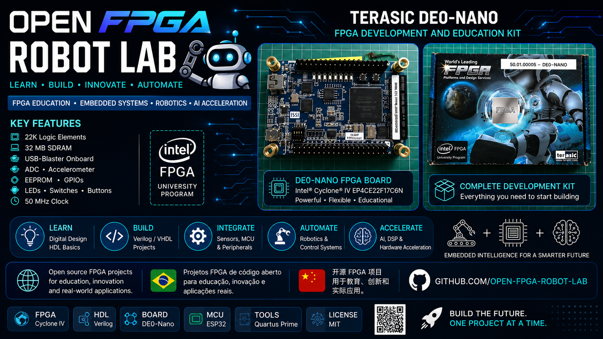

# Visão Geral da Placa DE0-Nano

  

## Introdução

A Terasic DE0-Nano é uma placa educacional FPGA baseada na família Intel/Altera Cyclone IV.

Esta placa é amplamente utilizada em:
- ensino de sistemas digitais
- robótica
- sistemas embarcados
- processamento de sinais
- aceleração por hardware
- aprendizagem FPGA

---

# O que é uma FPGA?

FPGA significa:

> Field Programmable Gate Array

Diferente de um microcontrolador tradicional, uma FPGA executa circuitos em paralelo.

Isso permite:
- processamento paralelo real
- lógica de alta velocidade
- arquiteturas customizadas
- aceleração por hardware

---

# Principais Componentes

## FPGA Cyclone IV

O principal chip da placa.

Responsável por:
- lógica digital
- máquinas de estado
- contadores
- interfaces de comunicação
- hardware customizado

---

## USB-Blaster

Utilizado para:
- programar a FPGA
- enviar bitstreams
- depurar projetos

---

## LEDs

Úteis para:
- depuração
- primeiros projetos FPGA
- visualização de hardware

---

## GPIO

Permite conexão com:
- sensores
- displays
- motores
- ESP32
- módulos robóticos

---

## Acelerômetro (ADXL345)

Mede:
- movimento
- inclinação
- aceleração

Útil para:
- robótica
- sistemas de equilíbrio
- detecção de movimento

---

# Fluxo Típico FPGA

1. Criar projeto HDL
2. Escrever código Verilog
3. Compilar projeto
4. Configurar pinos FPGA
5. Gerar bitstream
6. Programar FPGA
7. Testar hardware

---

# Objetivos Educacionais

Este projeto foi criado para fornecer:
- tutoriais passo a passo
- aprendizagem prática FPGA
- documentação multilíngue
- material educacional moderno

---

# Próximo Módulo

Continuar para:

## 02_fpga_basics

Onde aprenderemos:
- clocks
- lógica digital
- registradores
- FSM
- processamento paralelo
